# Work Order Management System

## system
- "php": "^8.1",
- Composer
- MySQL database
- Laravel Framework 8.83.27

## Setup Aplikasi

### 1. Clone Repository
```bash
git clone https://github.com/h-yusuf/PipeX.git
cd PipeX
```

### 2. Install Dependencies
```bash
composer install
```

### 3. Konfigurasi **.env**
Salin file `.env.example` menjadi `.env`:
```bash
cp .env.example .env
```
Edit file `.env` sesuai dengan konfigurasi database:
```ini
DB_CONNECTION=mysql
DB_HOST=127.0.0.1
DB_PORT=3306
DB_DATABASE=pipx_management
DB_USERNAME=root
DB_PASSWORD=password_mysql
```

### 4. Generate Application Key
```bash
php artisan key:generate
```

### Jalankan Migration & Seeder
```bash
php artisan migrate --seed
```

### Jalankan Server Laravel
```bash
php artisan serve
```
Akses aplikasi di browser: `http://127.0.0.1:8000`

---

## Akun Default
Jika seeder dijalankan, berikut akun default yang bisa digunakan untuk login:
bisa login by email atau username atau NPK

- **Admin**
  - Email: `admin@gmail.com`
  - U-name: `admin`
  - Password: `secret`

- **Manager**
  - Email: `manager@gmail.com`
  - U-name: `manager`
  - Password: `secret`

- **Operator**
  - Email: `operator@gmail.com`
  - U-name: `operator`
  - Password: `secret`

Selamat menggunakan aplikasi Work Order Management System! 🚀

### Untuk QA 20000 data Work Order bisa seeder dengan 
```bash
php artisan db:seed --class=BigDataDummySeeder
```


## 🚀 Fitur-Fitur Utama

### 👤 User Management  
Mengelola data user yang memiliki akses ke sistem dengan berbagai peran dan tanggung jawab.

- **Daftar User**  
  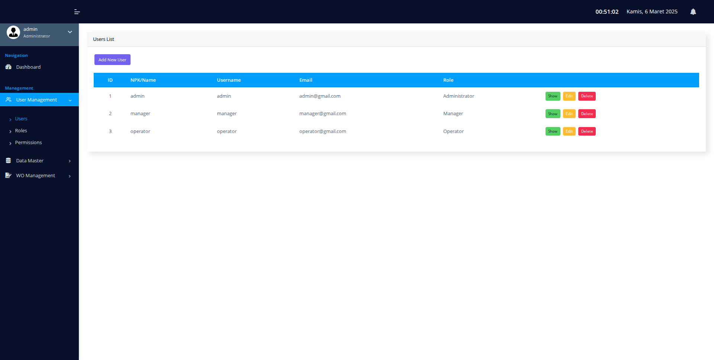

- **Tambah User**  
  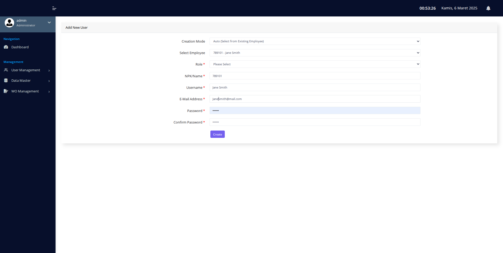
---

### 🔐 Role & Permission Management  
Mengelola hak akses dan izin pengguna dalam sistem sesuai kebutuhan operasional.

- **Role Management**  
  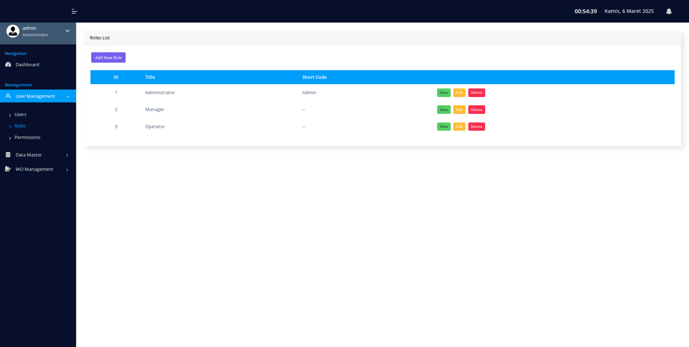

- **Tambah Role**  
  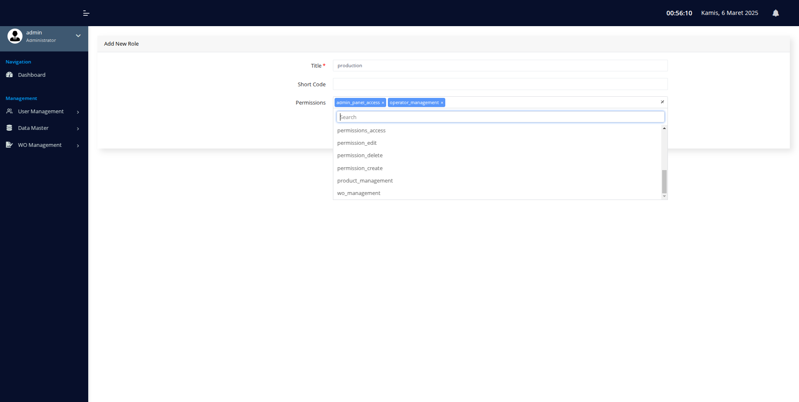

- **Permission Management**  
  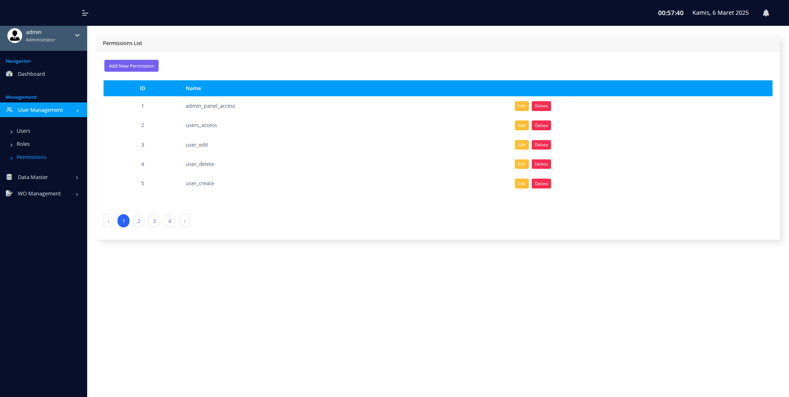

---

### 📦 Product Management  
Mengelola data produk yang terlibat dalam proses produksi Work Order.

- **Daftar Produk**  
  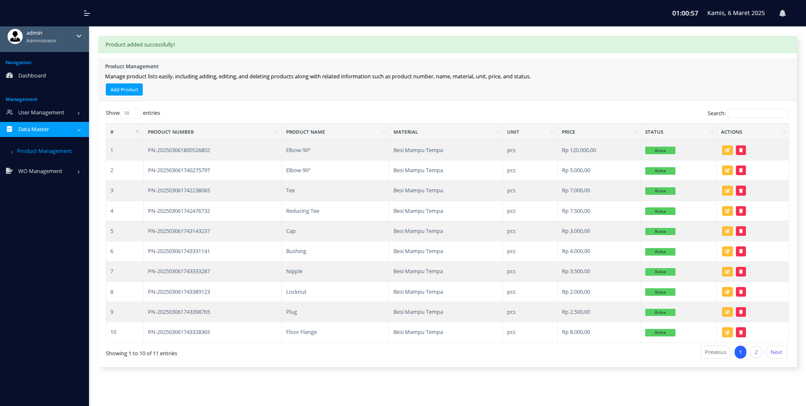

- **Tambah Produk**  
  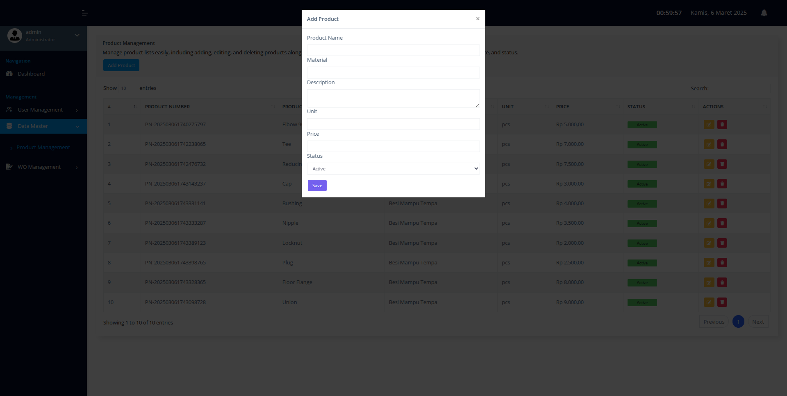

- **Update Produk**  
  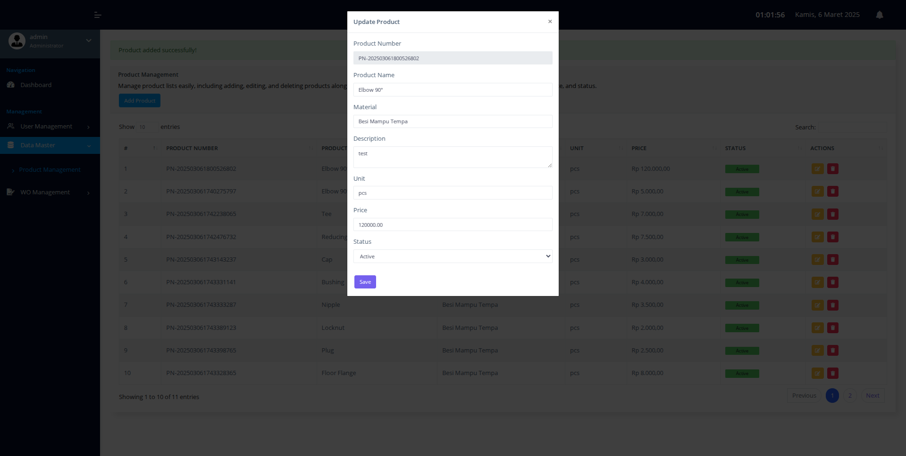

---

### 📝 Work Order (WO) Management  
Production Manager Mengelola proses Work Order mulai dari Membuat work order serta plot operator, update, monitoring hingga laporan.

- **Daftar Work Order**  
  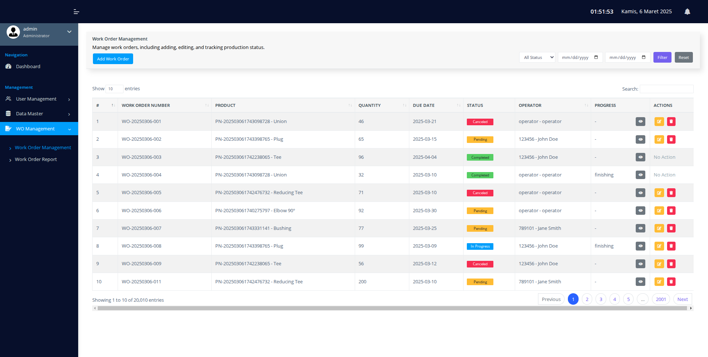

- **Plan And Plot Work Order**  
  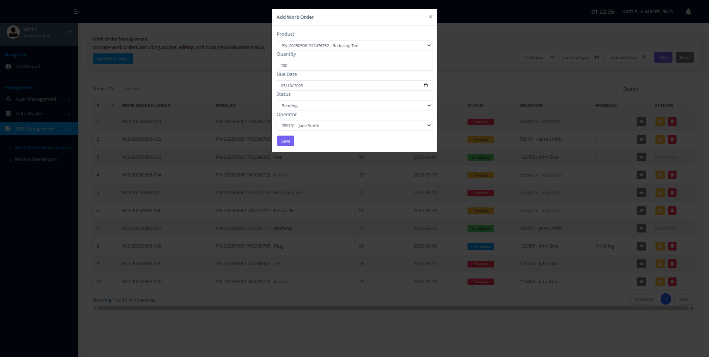

- **Update Work Order**  
  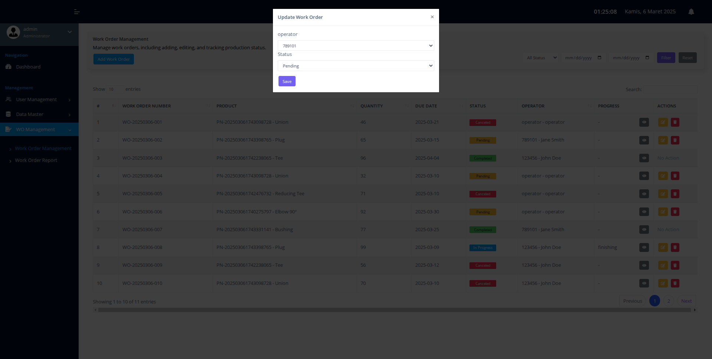

- **Hapus Work Order**  
  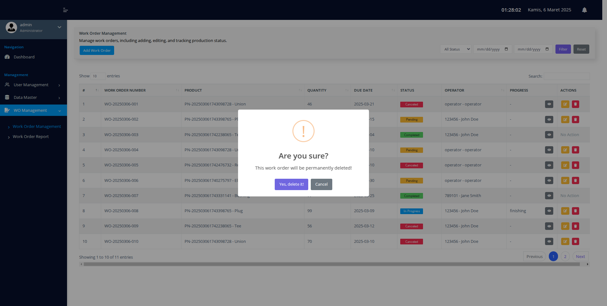

- **Progress Work Order**  
  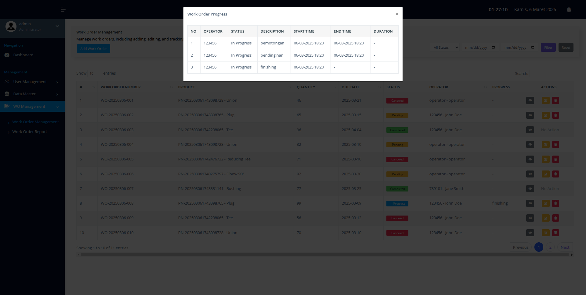

- **Laporan Work Order**  
  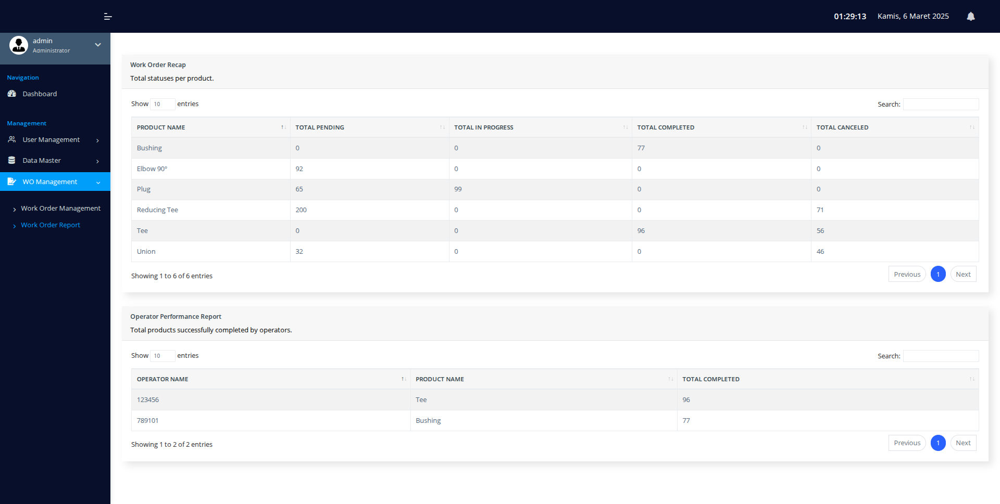

---

### 👥 Operator   
halamam Operator

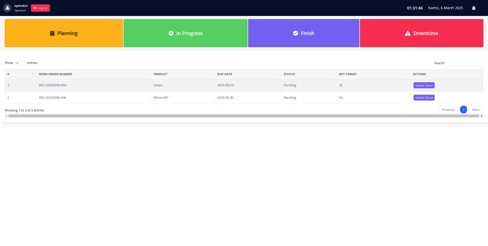

---

### 🎥 Demo Penggunaan Pov Operator

https://drive.google.com/file/d/12Nyw_W3AUdwYC82rFHLJxub-WGtWCeaa/view?usp=sharing

---

